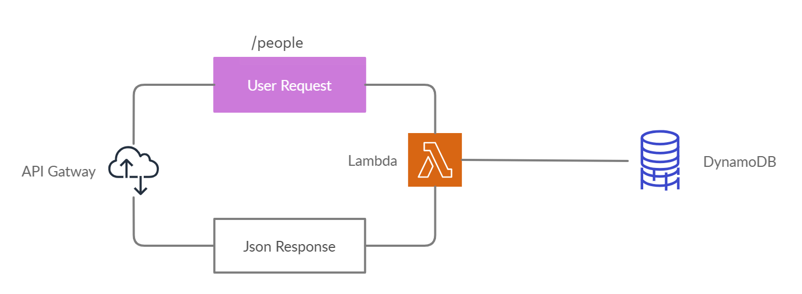

# lab18

[Repo Link](https://github.com/malakMomani/lab18)

[Routing link](https://w2bs31mm8h.execute-api.us-east-1.amazonaws.com/people)

**What is the root URL to your API?**

- <https://w2bs31mm8h.execute-api.us-east-1.amazonaws.com>

**What are the routes?**

- PUT
- DELETE
- POST
- GET

**What inputs do they require?**

- the id of required person

**What output do they return?**

- people

UML :

